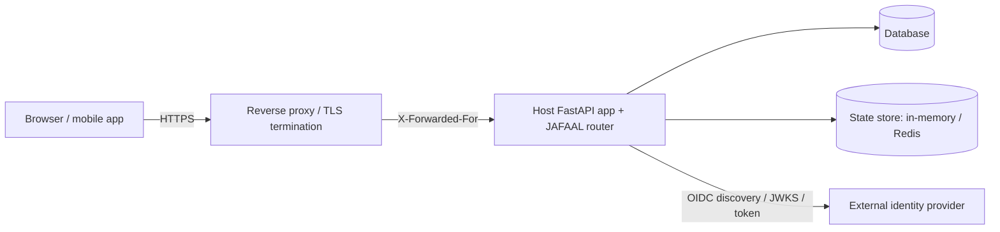

# Threat model & security invariants

This page states what JAFAAL defends against, what it delegates to the host, and
the internal invariants the library maintains. Use it to reason about where your
deployment's security boundary sits.

## Trust boundaries

- **Host-owned, outside JAFAAL:** TLS termination, the reverse proxy, the rate
  limiter backend, the database and its access control, secret storage/rotation,
  transport headers (HSTS/CSP), and the deployment topology (worker count).
- **JAFAAL-owned:** credential verification, token issuance/validation, session
  and refresh-token lifecycle, MFA, the OIDC client, progressive lockout, and the
  audit stream.

## What JAFAAL defends against

| Threat | Defence |
| --- | --- |
| Password brute-force / credential stuffing | Argon2 hashing, per-account **and** per-source-IP progressive lockout, host rate limiter (required when deployed). |
| Username enumeration | Timing-equalised dummy Argon2 verify on the "user not found" and "SSO-only" branches; generic error messages. |
| JWT forgery / `alg=none` / algorithm confusion | HS256 pinned; the decode allow-list is mandatory and cannot drift from the signing algorithm. |
| OIDC ID-token forgery | Signature verified against the IdP JWKS with an asymmetric-only allow-list (blocks RS256→HS256 confusion); `iss`/`aud`/`exp`/`iat`, `nonce`, `azp`, and (when present) `at_hash` are validated. |
| Refresh-token theft / replay | One-time rotation with reuse detection; a replay past the grace window invalidates the whole token family; in-grace retries replay one idempotent result. |
| CSRF (web) | `HttpOnly` + `SameSite=Strict` refresh cookie (primary); HMAC-bound CSRF token (defense-in-depth); optional `__Secure-`/`__Host-` cookie-name prefix. |
| TOTP replay | Matched timestep is recorded single-use; a second use within the validity window is rejected. Fails **closed** on a state-store outage by default. |
| OAuth authorization-code replay / mix-up | Single-use, atomically-consumed `state`; `state`→IdP binding; PKCE (S256) on both the mobile client flow and the upstream authorization-code exchange to the IdP. |
| SSRF via OIDC URLs | Scheme allow-list (`https` required for IdP endpoints by default), every resolved address must be public, pinned-IP connection (DNS-rebinding defence), guard re-runs on each redirect hop. |
| Source-IP spoofing | Proxy headers honoured only from configured `trusted_proxies`. |
| Secret disclosure at rest | IdP secrets, MFA secrets, rotated refresh tokens, and upstream PKCE verifiers are Fernet-encrypted; refresh/CSRF tokens are stored as keyed HMACs. |

## What JAFAAL does NOT do (host responsibilities)

- **Terminate TLS / set transport security headers.** Serve everything over
  HTTPS and set HSTS and a Content-Security-Policy (see
  [Security → Response headers](security.md#response-headers-for-sso-redirect-pages)).
- **Enforce rate limits.** JAFAAL only *tags* sensitive/write endpoints; you
  inject the limiter. In a deployed environment startup **fails closed** without
  one (`allow_no_rate_limit_when_deployed` opts out).
- **Store secrets.** You supply `secret_key` / `fernet_key`; JAFAAL never reads
  the environment. See [Key rotation](key-rotation.md).
- **Provide a distributed state store** for multi-worker deployments (startup
  fails closed on the in-memory store when deployed).
- **Authorize business actions.** JAFAAL authenticates and enforces scopes; your
  application owns per-resource authorization.
- **Breach-screen passwords.** Pair `password_type="length_only"` with a
  host-side breached-password check for full NIST SP 800-63B alignment.

## Security invariants

These hold by construction and are covered by the test suite and the
`import-linter` contracts:

1. **Algorithm pinning.** JWT signing/verification is HS256 only; ID-token
   verification accepts asymmetric algorithms only. The decode allow-list is
   always passed explicitly.
2. **Signing keys never leave the process.** `secret_key`/`fernet_key` are used
   to sign/verify/encrypt only; fallbacks are verify-/decrypt-only.
3. **Refresh tokens are one-time.** Every successful refresh rotates the token;
   a token is valid for exactly one non-replay use.
4. **Fail closed when deployed.** Missing rate limiter, in-memory state store,
   and (by default) a TOTP-replay state-store outage all fail closed in a
   deployed environment.
5. **No plaintext long-lived secrets at rest.** Passwords are Argon2-hashed;
   opaque tokens are HMAC- or SHA-256-hashed; reversible secrets are
   Fernet-encrypted.
6. **The core never imports an adapter or an optional dependency.** `import
   jafaal` pulls no `redis`/`authlib`/`pyotp`; features fail fast with an install
   hint when used without their extra.
7. **Boundary types stay framework-agnostic.** `JafaalError` subclasses carry
   HTTP hints but import no web framework; one edge handler maps them to HTTP.

## Reporting

Report suspected vulnerabilities privately — see
[SECURITY.md](https://codeberg.org/endurain-project/jafaal/src/branch/main/SECURITY.md).
Do not open a public issue.
